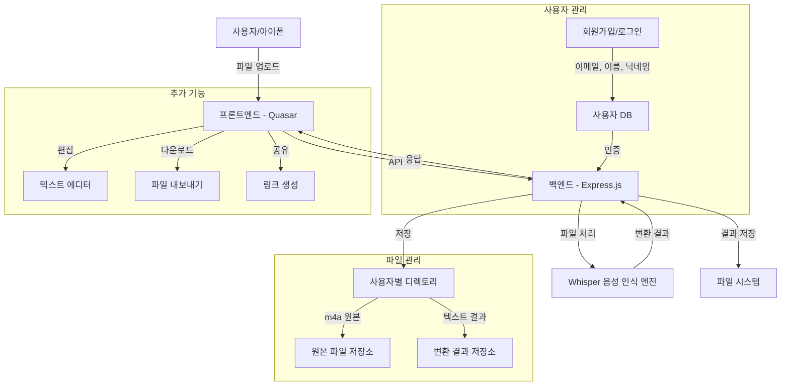
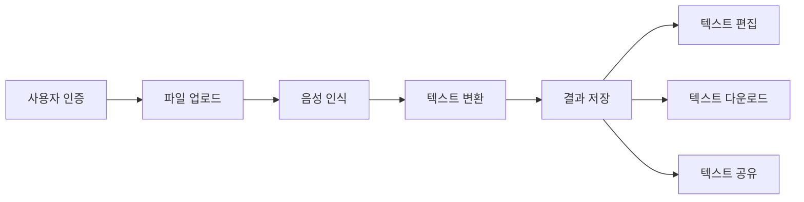
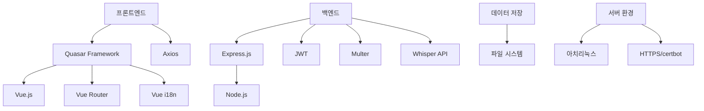

# 음성 트랜스크립트 웹 애플리케이션

음성 파일(m4a, mp3, wav 등)을 텍스트로 변환하는 웹 애플리케이션입니다. 아이폰에서 접속하여 음성 파일을 업로드하면 한국어 음성을 텍스트로 변환하여 저장하고 화면에 출력합니다.

## 시스템 아키텍처



## 주요 기능



1. **사용자 인증 시스템**
   - 회원가입 및 로그인 기능
   - JWT 기반 인증
   - 사용자 정보 관리 (이메일, 이름, 닉네임)

2. **음성 파일 처리**
   - m4a, mp3, wav, ogg, flac 형식 지원
   - 파일 업로드 및 관리
   - OpenAI Whisper 기반 음성 인식 (한국어 특화)
   - 비동기 처리 방식

3. **트랜스크립트 관리**
   - 변환된 텍스트 저장 및 조회
   - 텍스트 편집 기능
   - 다운로드 기능
   - 삭제 기능

4. **다국어 지원**
   - 한국어 기본 지원
   - 영어 지원

## 기술 스택



- **프론트엔드**: Quasar Framework (Vue.js), Vue Router, Vue i18n, Axios
- **백엔드**: Express.js, Node.js, JWT, Multer, Whisper API
- **데이터 저장**: 파일 시스템
- **서버 환경**: 아치리눅스, HTTPS (certbot)

## 설치 및 실행 방법

### 사전 요구사항

- Node.js 16.x 이상
- Yarn 패키지 매니저
- OpenAI Whisper (또는 호환 가능한 음성 인식 엔진)

### 백엔드 설치 및 실행

```bash
# 저장소 클론
git clone https://github.com/yourusername/audio-transcript.git
cd audio-transcript

# 백엔드 의존성 설치
cd audio-transcript-app/backend
yarn install

# 환경 변수 설정 (.env 파일 생성)
cp .env.example .env
# .env 파일을 편집하여 필요한 설정 추가

# 개발 서버 실행
yarn dev

# 프로덕션 서버 실행
yarn start
```

### 프론트엔드 설치 및 실행

```bash
# 프론트엔드 의존성 설치
cd ../frontend/audio-transcript-front
yarn install

# 개발 서버 실행
yarn dev

# 프로덕션 빌드
yarn build
```

## API 엔드포인트

### 인증 API

| 엔드포인트 | 메서드 | 설명 | 요청 본문 | 응답 |
|------------|--------|------|-----------|------|
| `/api/auth/register` | POST | 사용자 등록 | `{ email, name, nickname, password }` | `{ message, user, token }` |
| `/api/auth/login` | POST | 로그인 | `{ email, password }` | `{ message, user, token }` |
| `/api/auth/me` | GET | 현재 사용자 정보 조회 | - | `{ user }` |
| `/api/auth/me` | PUT | 사용자 정보 업데이트 | `{ name, nickname }` | `{ message, user }` |

### 트랜스크립트 API

| 엔드포인트 | 메서드 | 설명 | 요청 본문 | 응답 |
|------------|--------|------|-----------|------|
| `/api/transcripts` | GET | 트랜스크립트 목록 조회 | - | `{ transcripts }` |
| `/api/transcripts/upload` | POST | 음성 파일 업로드 | `FormData (audio)` | `{ message, transcript }` |
| `/api/transcripts/:id` | GET | 특정 트랜스크립트 조회 | - | `{ transcript }` |
| `/api/transcripts/:id/text` | PUT | 트랜스크립트 텍스트 업데이트 | `{ text }` | `{ message, transcript }` |
| `/api/transcripts/:id` | DELETE | 트랜스크립트 삭제 | - | `{ message }` |
| `/api/transcripts/:id/download` | GET | 트랜스크립트 텍스트 다운로드 | - | 텍스트 파일 |

## 프로젝트 구조

```
audio-transcript-app/
├── backend/                  # 백엔드 애플리케이션
│   ├── .env                  # 환경 변수 설정
│   ├── package.json          # 패키지 정보 및 스크립트
│   ├── src/
│   │   ├── index.js          # 서버 진입점
│   │   ├── controllers/      # 컨트롤러
│   │   ├── middlewares/      # 미들웨어
│   │   ├── models/           # 모델
│   │   ├── routes/           # 라우트
│   │   └── utils/            # 유틸리티
│   ├── uploads/              # 업로드된 파일 저장 디렉토리
│   └── transcripts/          # 변환된 텍스트 저장 디렉토리
│
└── frontend/                 # 프론트엔드 애플리케이션
    └── audio-transcript-front/
        ├── public/           # 정적 파일
        ├── src/
        │   ├── assets/       # 에셋 파일
        │   ├── boot/         # 부트 파일
        │   ├── components/   # 컴포넌트
        │   ├── css/          # CSS 파일
        │   ├── i18n/         # 다국어 파일
        │   ├── layouts/      # 레이아웃
        │   ├── pages/        # 페이지
        │   └── router/       # 라우터
        └── package.json      # 패키지 정보 및 스크립트
```

## 라이센스

이 프로젝트는 MIT 라이센스 하에 배포됩니다. 자세한 내용은 [LICENSE](LICENSE) 파일을 참조하세요.

## 기여 방법

1. 이 저장소를 포크합니다.
2. 새 브랜치를 생성합니다: `git checkout -b feature/amazing-feature`
3. 변경 사항을 커밋합니다: `git commit -m 'Add some amazing feature'`
4. 브랜치에 푸시합니다: `git push origin feature/amazing-feature`
5. Pull Request를 제출합니다.
